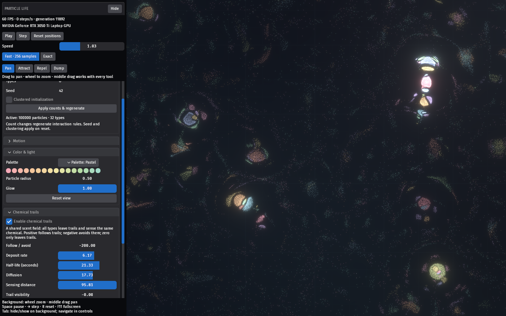

# Particle Life

A native Bevy playground with GPU particle simulation, directional attraction,
swirl, velocity alignment, preferred spacing, crowding response, type cycles, and chemical trails.

Run from this directory with `cargo run --release`. The world and background tile
seamlessly as you pan and zoom. Scroll to zoom, drag the background to pan, Space
to pause, Right Arrow to step, R to reset positions, Tab on the background to hide/show controls, and F11
for fullscreen.

## Chemical trails

Open **Chemical trails** and check **Enable chemical trails**. All particle types
deposit into one shared 512 × 512 chemical field:

- **Follow / avoid**: positive follows increasing concentration; negative avoids
  it. Zero keeps deposition and visualization without affecting motion.
- **Deposit rate**: chemical left per particle per simulation second. Zero lets
  existing trails fade without adding more.
- **Half-life**: seconds of simulation time for concentration to halve.
- **Diffusion**: how quickly scent spreads into neighboring cells.
- **Sensing distance**: how far particles sample to choose a direction.
- **Trail visibility**: brightness of the particle-colored overlay. Zero hides the field
  without turning off its effect on motion.
- **Clear trails**: removes the field without resetting particles, even paused.

Use the Enable chemical trails checkbox to switch trails on or off. Enabling/disabling or resetting the world clears
old trails. Pause freezes deposition, diffusion, and decay; stepping advances all
three with the particles. Trail following works alongside the interaction rules.
Deposits inherit the particle color at deposition time; overlapping colors mix,
and old colors fade naturally after palette changes.
The field and sensing wrap at the world edges. Chemical concentration is capped
at 100 to keep dense deposits bounded. Trail updates stay on the GPU and add
about 16 MiB of storage, independent of particle/type count.

Try the default trail settings first. Change Follow / avoid to a negative value
for particles that move away from their previous paths, or increase the half-life
to leave a longer memory of motion.

## Checks

`cargo test` checks settings, data layout, wrapping, and WGSL validation.
`cargo test -- --ignored` additionally runs a Vulkan GPU regression that verifies
chemical diffusion across both seams, decay, one-time deposition, and clearing.
